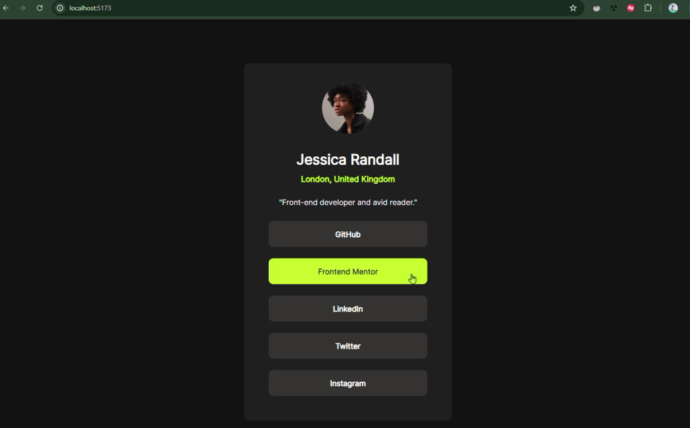

# React + Vite

This template provides a minimal setup to get React working in Vite with HMR and some ESLint rules.

Currently, two official plugins are available:

- [@vitejs/plugin-react](https://github.com/vitejs/vite-plugin-react/blob/main/packages/plugin-react/README.md) uses [Babel](https://babeljs.io/) for Fast Refresh
- [@vitejs/plugin-react-swc](https://github.com/vitejs/vite-plugin-react-swc) uses [SWC](https://swc.rs/) for Fast Refresh


## Table of contents

- [Overview](#overview)
  - [The challenge](#the-challenge)
  - [Screenshot](#screenshot)
  - [Links](#links)
  - [Built with](#built-with)
  - [What I learned](#what-i-learned)
  - [Useful resources](#useful-resources)
- [Author](#author)
- [Acknowledgments](#acknowledgments)

## Overview

### The challenge

Challenge Name : Social Links Profile

Users should be able to:

- See hover and focus states for all interactive elements on the page

### Screenshot



### Links

- Solution URL: [Add solution URL here](https://your-solution-url.com)
- Live Site URL: [Add live site URL here](https://your-live-site-url.com)

### Built with

- [React](https://reactjs.org/) - JS library
- [TailwindCss](https://tailwindcss.com/docs/) - For styling
- CSS custom properties
 
### What I learned

Focus state management using useState and to apply those conditionally: used conditional rendering.
For the handling of events onMouseEnter and onMouseLeave event-handlers were used.
 
```jsx
const [focusedIndex,setFocusedIndex] = useState(null);

  const  handleOnFocus = (i)=>{
    setFocusedIndex(i)
  }

  return (
    <div className='flex flex-col justify-center'>{socials.map((social,i)=>(
      <button className={`btn-transition justify-center items-center rounded-[10px] h-[55px]  m-3 ${focusedIndex === i ? ' bg-[#c5f82a] ':'  bg-[#333333]  '}`} 
      onMouseEnter={()=>handleOnFocus(i)}
      onMouseLeave={()=>setFocusedIndex(null)} key={i}><h1 className={`${focusedIndex === i ? 'text-[#333333] font-semibold':'text-[#ffffff] font-semibold' }`}>{social}</h1></button>
    ))}</div>
  )
```

For the transition I applied css class:

```css
.btn-transition{
    transition: ease-in;
}


.btn-transition:hover{
 transition-duration: 0.2s;
}
```
 
### Useful resources

- [React Learning resource ](https://github.com/Asabeneh/30-Days-Of-React/blob/master/01_Day_JavaScript_Refresher/01_javascript_refresher.md) - This helped me for learning react in a more indepth way as the auther himself gives us excersises after each section . I really liked this pattern and will use it going forward.
 -[Tailwindcss Documentation For Installation](https://tailwindcss.com/docs/installation) - This was inspired from my senior developer and as a beginner i would say it is easy and presice

## Author

- LinkedIn - [Megha K L](www.linkedin.com/in/312meghakl)
- Frontend Mentor - [@disismeg31](https://www.frontendmentor.io/profile/disismeg31)
 
## Acknowledgments

 - During the develpoment there were some syntactical and logical implimentation issues and i cleared those with the help of chatgpt, and some from stackoverflow

 - This challenge is from Frontend Mentor 
